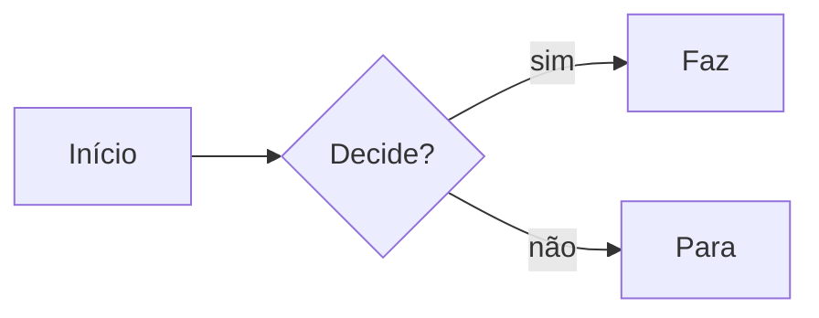
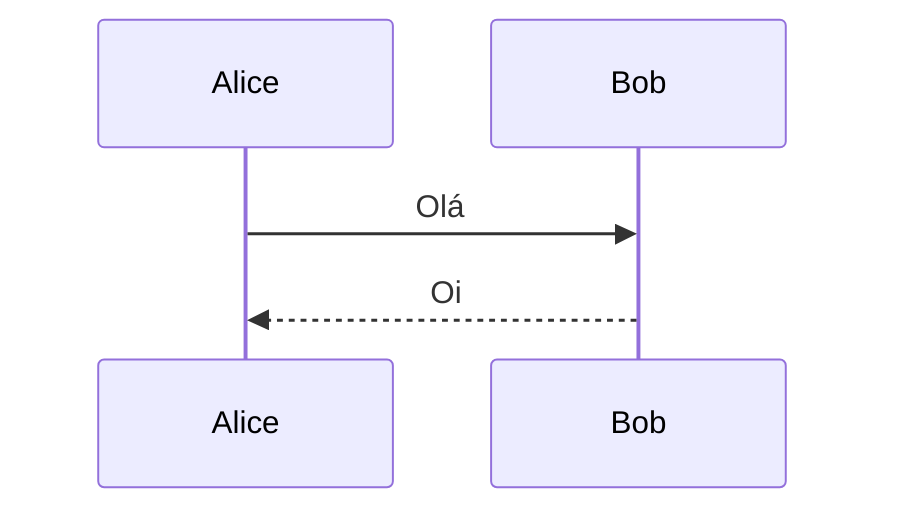

# Diagramas

Fluxograma:

```mermaid
flowchart LR
  A[Início] --> B{Decide?}
  B -->|sim| C[Faz]
  B -->|não| D[Para]
```

Sequência:

```mermaid
sequenceDiagram
  Alice->>Bob: Olá
  Bob-->>Alice: Oi
```

Inválido (deve aparecer como código com o motivo):

```mermaid
isto não é mermaid
```
