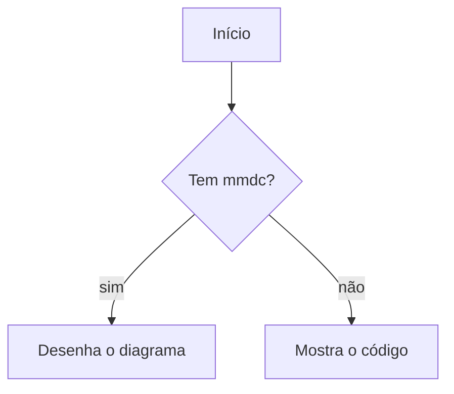

# Diagrama Mermaid

Sem `--mermaid` (ou sem o `mmdc` instalado), o bloco aparece como código.
Com `mdv --mermaid samples/mermaid.md`, vira imagem em meio-bloco.

```mermaid
graph TD
    A[Início] --> B{Tem mmdc?}
    B -->|sim| C[Desenha o diagrama]
    B -->|não| D[Mostra o código]
```
